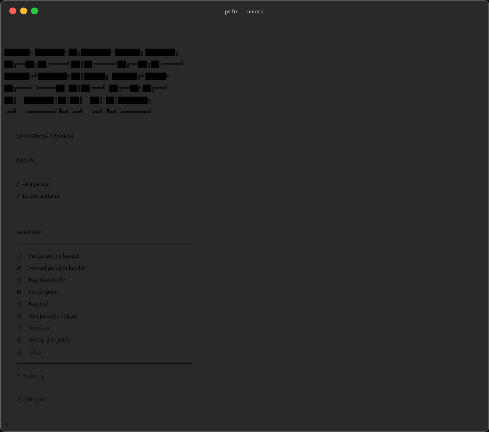
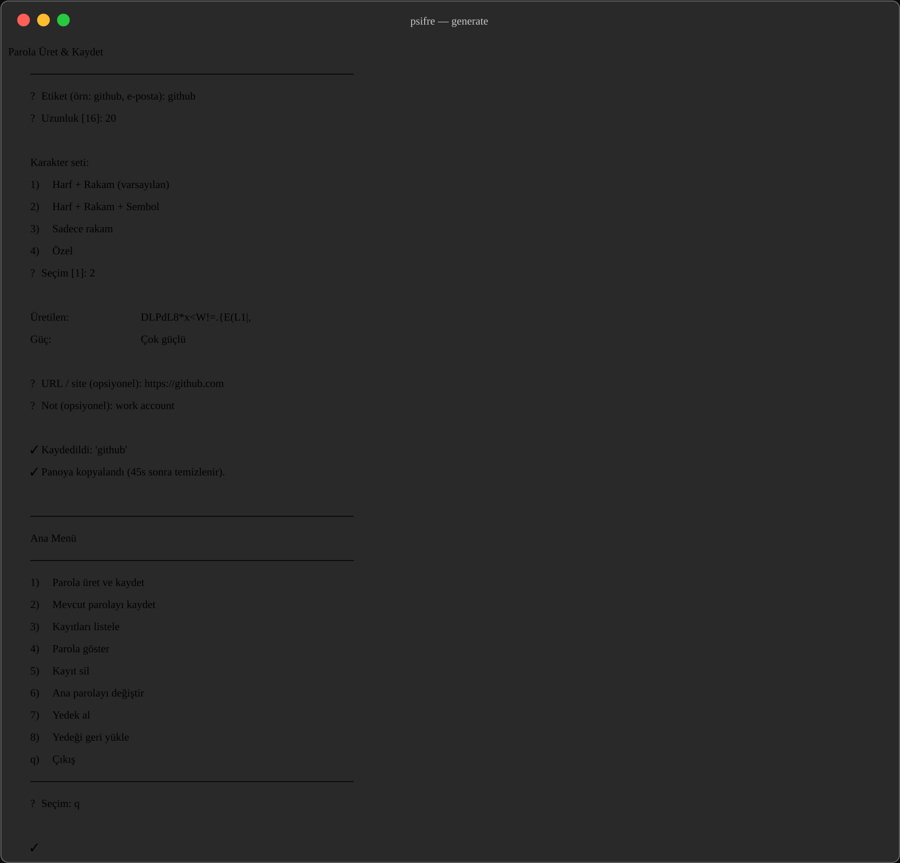
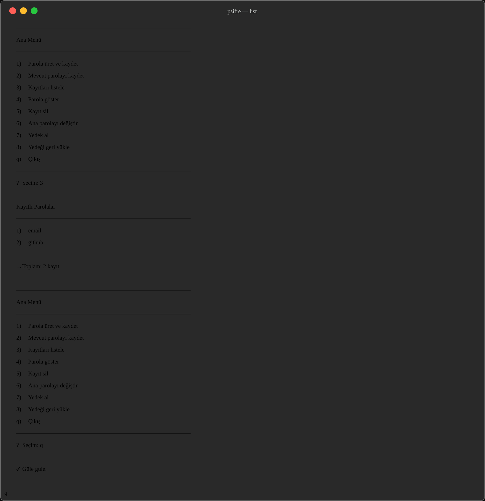
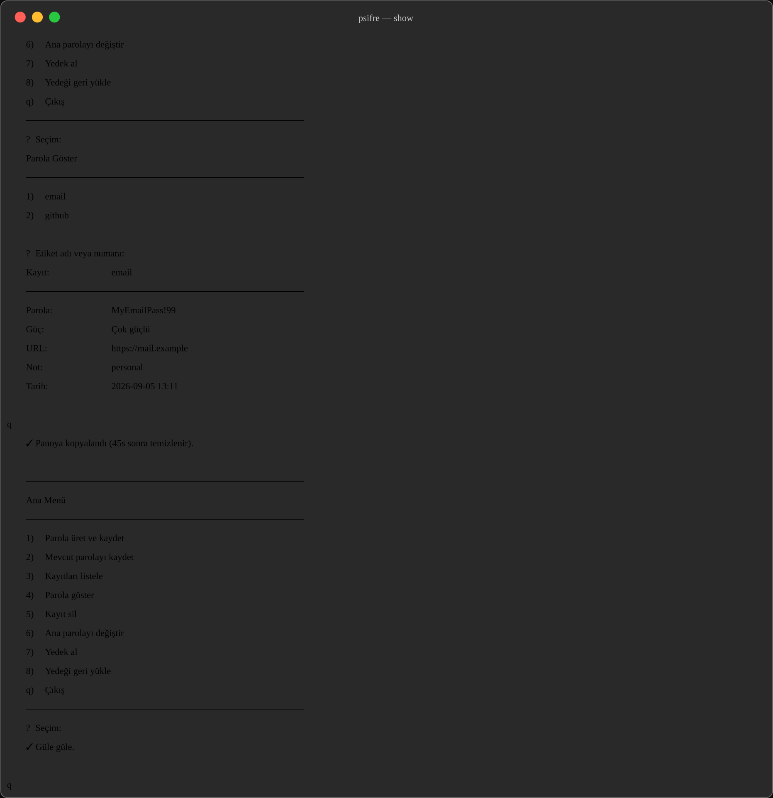

# psifre

Encrypted password manager for Linux terminals.

`psifre` stores labeled credentials under `~/.psifre`, encrypts each entry with your master password (AES-256-CBC + PBKDF2, integrity-protected with HMAC), and can generate strong passwords from `/dev/urandom`.



## Screenshots

### Generate & save

Create a labeled password, pick length and character set, then copy it to the clipboard (auto-clears after 45 seconds).



### List entries

Browse saved labels without revealing secrets.



### Reveal an entry

Show password, strength, URL, and notes; copy to clipboard when available.



## Features

- Master-password unlock with retry backoff and temporary lockout
- Generate passwords (letters, digits, symbols, or custom charset)
- Import existing passwords manually
- List, show, and delete entries
- Change master password with atomic store swap + recovery
- Encrypted backup / restore (`PSIFRE-BACKUP-V2`)
- Clipboard copy with timed clear (`wl-copy` / `xclip` / `xsel`)
- Collision-safe entry filenames and newline-safe field encoding

## Requirements

- Bash
- [OpenSSL](https://www.openssl.org/) (`openssl` CLI)
- Linux (`/dev/urandom`)
- Optional: `wl-copy`, `xclip`, or `xsel` for clipboard support

## Install

```bash
git clone https://github.com/Padrosum/psifre.git
cd psifre
chmod +x pfsifre
sudo ln -sf "$(pwd)/pfsifre" /usr/local/bin/psifre
```

Or run it in place:

```bash
./pfsifre
```

## Usage

```bash
psifre
```

On first launch you set a master password (min. 8 characters). Later launches ask for that password, then open the menu:

| Key | Action |
|-----|--------|
| `1` | Generate and save a password |
| `2` | Save an existing password |
| `3` | List entries |
| `4` | Show an entry |
| `5` | Delete an entry |
| `6` | Change master password |
| `7` | Create encrypted backup |
| `8` | Restore from backup |
| `q` | Quit |

Custom store location:

```bash
PSIFRE_DIR=/path/to/store ./pfsifre
```

## Storage & security

| Item | Location / detail |
|------|-------------------|
| Store directory | `~/.psifre` (mode `700`) |
| Master verify blob | `~/.psifre/.verify` |
| Entries | `~/.psifre/*.enc` (mode `600`) |
| Encryption | AES-256-CBC, PBKDF2 (`200000` iterations) |
| Integrity | Encrypt-then-MAC (HMAC-SHA256), `v2:` records |
| Payload | Versioned fields (`v=2`) with base64-safe values |

Keep backups offline. If you lose the master password, encrypted entries cannot be recovered.

## License

See [LICENSE](LICENSE).
